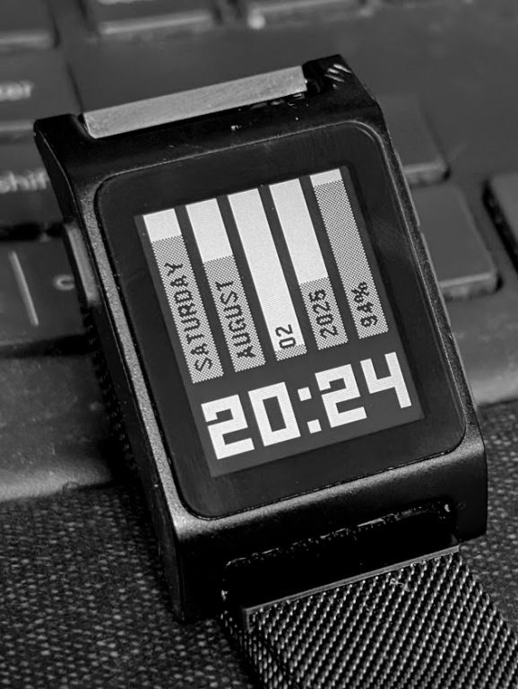
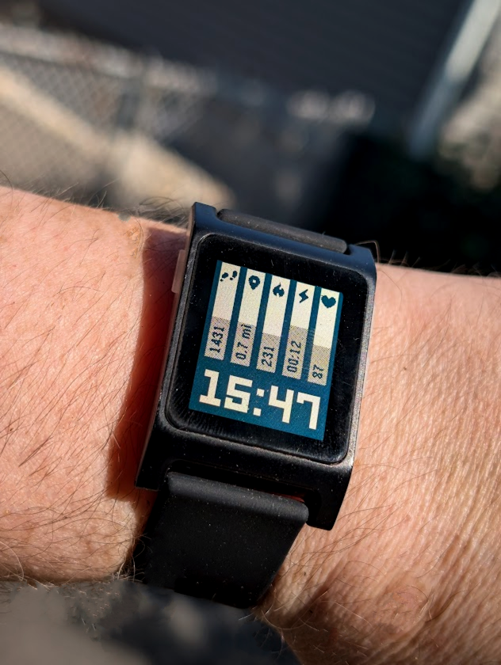

# Vertical-Health Watchface

A minimalist vertical column-based watchface for Pebble smartwatches featuring dual-mode display with date information and health metrics.

 

## Features

### 🕐 Time Display
- Large, clear time display using custom LECO font
- 12/24 hour format support
- Optimized font sizes for different Pebble models

### 📅 Date Mode (Default)
- **Day of Week** - Current weekday with progress through the week
- **Month** - Current month with yearly progress  
- **Date** - Day of month with monthly progress
- **Year** - Current year with century progress
- **Battery** - Battery percentage with visual indicator

### 💪 Health Mode (Health-capable watches only)
- **Steps** - Daily step count with goal progress
- **Distance** - Walking distance in miles with goal progress
- **Calories** - Active calories burned with goal progress  
- **Active Time** - Active minutes in HH:MM format with goal progress
- **Heart Rate** - Current heart rate (when available)

### 🎯 Interactive Features
- **Tap to Toggle** - Tap the watch to switch between date and health modes
- **Visual Progress Bars** - Each column shows completion percentage
- **Health Icons** - Clear icons for each health metric
- **Rotated Display** - Unique 90° rotated layout for vertical columns

## Compatibility

### ✅ Supported Pebble Models
- **Pebble Time** (Health features available)
- **Pebble Time Steel** (Health features available)
- **Pebble 2** (Health features available)
- **Pebble Time 2** (Health features available)
- **Pebble Classic/Original** (Date mode only)
- **Pebble Steel** (Date mode only)

### 🏥 Health Features
Health metrics are automatically enabled on compatible hardware. On watches without health sensors, only the date mode is available.

## Technical Details

### Architecture
- Uses [pebble-effect-layer](https://www.npmjs.com/package/pebble-effect-layer) for 90° rotation
- Conditional compilation for health features (`#ifdef PBL_HEALTH`)
- Memory-optimized with custom font subsetting

### Font Optimization
- Custom LECO font subset containing only numbers and colon `[0-9:]`
- Multiple font sizes for different screen resolutions
- Resolves glyph size limitations at larger font sizes

### Display Logic
1. Draws horizontal bars and text using standard Pebble graphics
2. Applies 90° rotation via effect layer for vertical appearance
3. Dynamic progress calculation based on current date/health data
4. Efficient bitmap rendering for health icons

